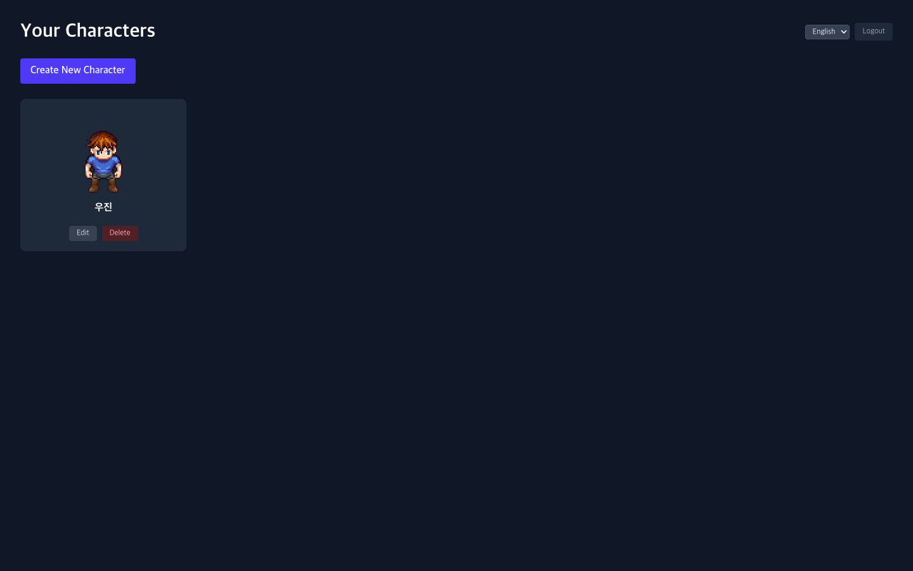
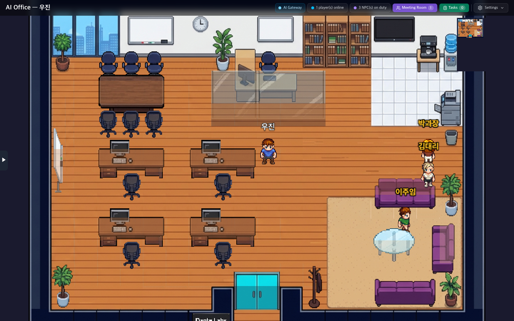
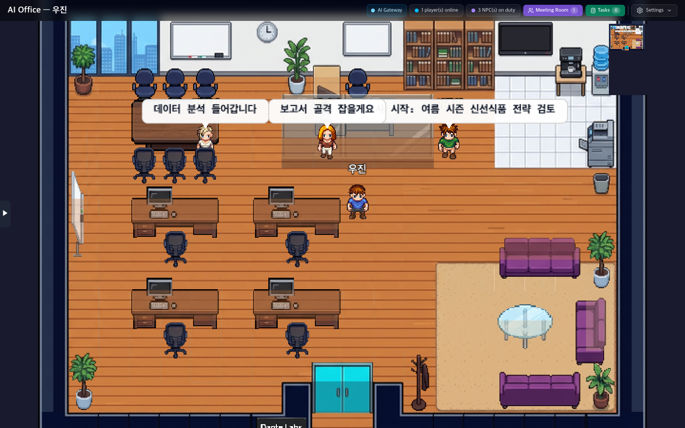
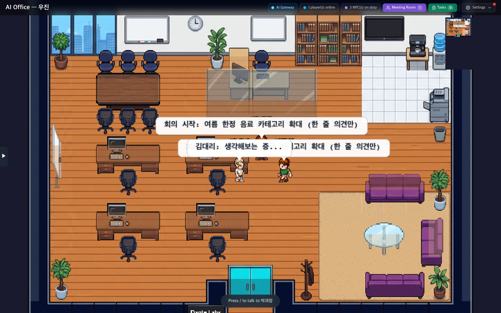
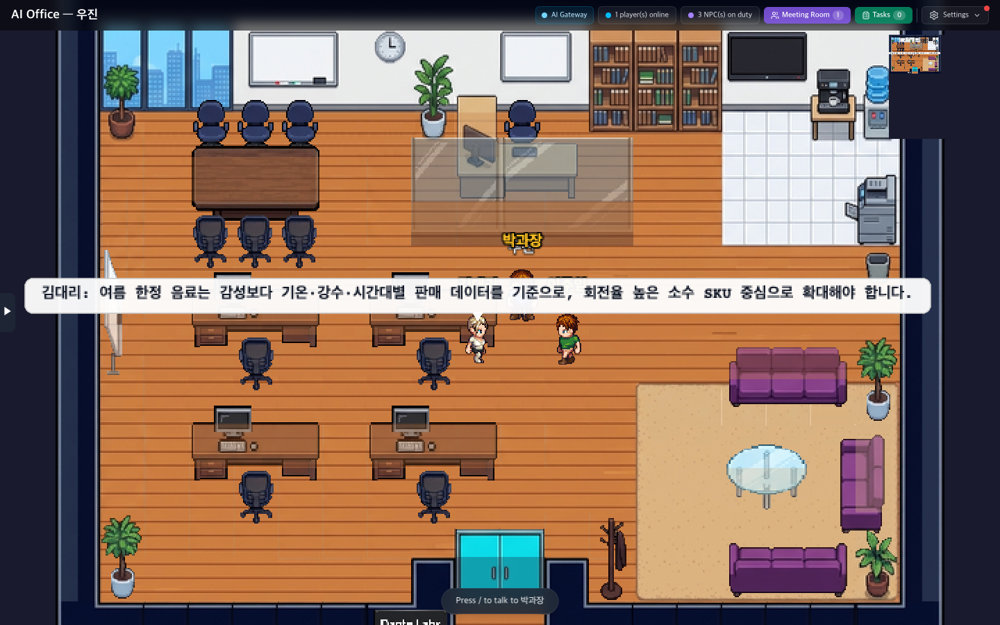
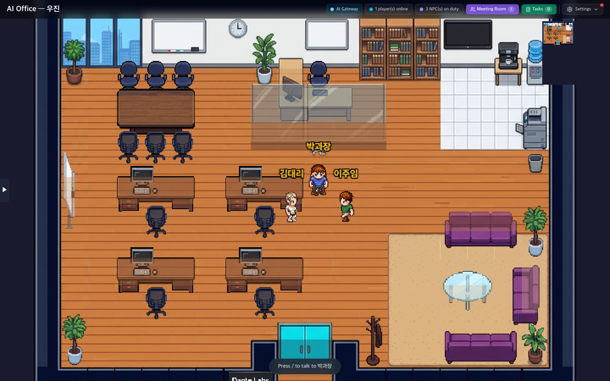
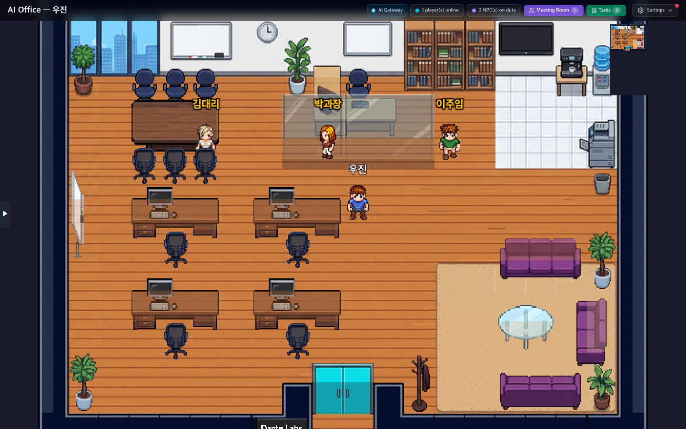

# 🎬 AI Office Agents — 데모 설명서 (초보자용)

> 3명의 AI 직원이 가상 사무실에서 일하고 회의하는 시스템.
> 이 문서는 **처음 보는 사람도** 따라할 수 있게 만들었습니다.

---

## 📋 목차

1. [이게 뭔가요?](#-이게-뭔가요)
2. [지금 한 번 보기 (1분)](#-지금-한-번-보기-1분)
3. [한 번이 아니라 매번 잘 돌리려면](#-한-번이-아니라-매번-잘-돌리려면)
4. [3개의 LLM을 다르게 쓰려면](#-3개의-llm을-다르게-쓰려면)
5. [텔레그램으로 명령하려면](#-텔레그램으로-명령하려면)
6. [실제로 무슨 일이 일어나는가](#-실제로-무슨-일이-일어나는가)
7. [고장 났을 때](#-고장-났을-때)

---

## 🤔 이게 뭔가요?

**디지털 트윈 사무실**입니다. 진짜 회사처럼:

- 김대리, 박과장, 이주임이 사무실 안을 돌아다닙니다
- 가끔 "분석 중...", "보고서 다듬는 중" 같은 풍선 메시지를 띄웁니다
- 텔레그램이나 명령 한 줄로 회의를 소집하면, 3명이 회의실로 모입니다
- 회의에서는 **진짜 AI 모델** (OpenAI / Claude / Gemini)이 의견을 내놓습니다
- 풍선으로 의견을 띄우고, 끝나면 자기 자리로 돌아갑니다

| 캐릭터 | 모델 | 역할 |
|---|---|---|
| 📊 김대리 | OpenAI GPT | 데이터 분석, 시장 조사 |
| ✍️ 박과장 | Claude | 보고서, 품질 관리 |
| 🔍 이주임 | Gemini | 리서치, 새 아이디어 |

---

## ⚡ 지금 한 번 보기 (1분)

### 단계 1: 브라우저로 사무실 들어가기

먼저 컴퓨터에서 크롬이나 사파리를 열고 이 주소로 들어가세요:

```
http://localhost:3000
```

로그인 화면이 보이면 본인 계정으로 로그인합니다.

**📸 화면 1 — 로그인 후 채널 목록**



> 💡 만약 "캐릭터 생성 실패" 같은 빨간 메시지가 보이면, 시크릿 창을 열어서 다시 시도하세요. 쿠키가 꼬인 상태입니다.

### 단계 2: "AI Office" 채널 클릭

목록에서 **AI Office**를 클릭하면 사무실이 열립니다.

**📸 화면 2 — 사무실 진입 (3명의 NPC 보임)**



여기서 잠시 가만히 보고 있으면, 3명의 NPC가 자기 마음대로 사무실 안을 돌아다니는 걸 볼 수 있습니다.

**📸 화면 3 — 자율 산책 중**


### 단계 3: 업무 분배 시키기

다른 터미널 창을 열고 이 명령을 복사해서 붙여넣고 엔터:

```bash
curl -X POST http://127.0.0.1:13000/office/task \
  -H 'Content-Type: application/json' \
  -d '{"task":"여름 시즌 신선식품 전략 검토"}'
```

응답: `{"ok":true,"distributed":3}` 가 보이면 성공.

브라우저로 돌아가면 3명이 각자의 자리로 휙 이동하고 풍선 메시지가 뜹니다.

**📸 화면 4 — 업무 받고 자기 자리로**



### 단계 4: 회의 소집 (진짜 AI가 의견 냄)

```bash
curl -X POST http://127.0.0.1:13000/office/meeting \
  -H 'Content-Type: application/json' \
  -d '{"topic":"여름 한정 음료 카테고리 확대"}'
```

명령을 보내면:
1. 3명이 회의실 좌석으로 모입니다
2. 각자 진짜 AI 모델을 호출해서 의견을 만듭니다 (60~90초 걸림)
3. 의견이 풍선으로 표시됩니다
4. 끝나면 자기 자리로 돌아갑니다

**📸 화면 5 — 회의 시작**



**📸 화면 6 — AI 의견 풍선 표시**



**📸 화면 7 — 회의 후반**



**📸 화면 8 — 회의 종료, 자기 자리로**



---

## ♻️ 한 번이 아니라 매번 잘 돌리려면

컴퓨터를 껐다 켠 후 다시 사용하려면 3가지를 다시 가동해야 합니다.

### 1️⃣ OpenClaw 게이트웨이

```bash
openclaw gateway --force
```

> 💡 `--force` 는 기존 프로세스 죽이고 새로 띄움. 사용자 입력 없이 백그라운드로 가도록 nohup 가능.

### 2️⃣ DeskRPG dev-server (사무실 화면)

```bash
cd /Users/heoujin/ai-office-agents/desk_rpg_model
npm run dev > ../logs/deskrpg.log 2>&1 &
echo $! > ../.pids/deskrpg.pid
```

### 3️⃣ 끝!

이 두 개만 살아 있으면 모든 게 됩니다. 트리거 서버(:13000)와 wander loop는 dev-server가 자동으로 켜줍니다.

**상태 확인** 한 번에:

```bash
lsof -ti :3000 :13000 :18789
```

세 줄(=세 개 프로세스 ID)이 나오면 정상.

---

## 🎭 3개의 LLM을 다르게 쓰려면

**지금은 3명이 전부 같은 OpenAI 모델**을 쓰고 있습니다. 김대리=GPT, 박과장=Claude, 이주임=Gemini로 나누려면 키 3개를 발급해야 합니다.

### 키 발급 (각각 10분)

| 모델 | 발급 페이지 | 가격 |
|---|---|---|
| **Claude** | https://console.anthropic.com/settings/keys | $5 무료 크레딧 |
| **OpenAI** | https://platform.openai.com/api-keys | 종량제 (소액 결제 필요) |
| **Gemini** | https://aistudio.google.com/apikey | 무료 (제한 있음) |

### 키를 .env.local 파일에 넣기

`/Users/heoujin/ai-office-agents/.env.local` 파일을 열어서:

```bash
# 이전 (placeholder)
OPENAI_API_KEY=sk-xxxx
ANTHROPIC_API_KEY=sk-ant-xxxx
GOOGLE_AI_API_KEY=AIzaSyxxxx

# 이후 (실제 키로 교체)
OPENAI_API_KEY=sk-proj-실제키여기에
ANTHROPIC_API_KEY=sk-ant-api03-실제키여기에
GOOGLE_AI_API_KEY=AIzaSy실제키여기에
```

### 자동 매핑 스크립트 실행

```bash
bash /Users/heoujin/ai-office-agents/scripts/configure-llm-models.sh
```

이 스크립트가 끝나면:
- 김대리 → OpenAI GPT-4o
- 박과장 → Claude Sonnet 4.5
- 이주임 → Gemini 2.5 Flash

각자 다른 모델로 회의 의견을 내놓습니다.

> 💡 매핑 후 dev-server 재시작 안 해도 됩니다. OpenClaw가 자동 인식.

---

## 📱 텔레그램으로 명령하려면

### 1. 봇 만들기 (5분)

1. 텔레그램에서 [@BotFather](https://t.me/BotFather) 검색
2. `/newbot` → 봇 이름 → 사용자명 (xxxxxBot으로 끝나야 함) 입력
3. 받은 토큰 복사 (예: `7654321098:AAGxxxxxxxxxxxxx`)

### 2. 내 텔레그램 ID 알기

1. [@userinfobot](https://t.me/userinfobot) 검색 → `/start`
2. 응답에 나온 `Id:` 숫자 복사

### 3. .env.local 에 넣기

```bash
TELEGRAM_BOT_TOKEN=7654321098:AAGxxxxxxxxxxxxx
TELEGRAM_ALLOWED_USERS=123456789
```

### 4. dev-server 재시작

```bash
kill $(cat /Users/heoujin/ai-office-agents/.pids/deskrpg.pid)
cd /Users/heoujin/ai-office-agents/desk_rpg_model
npm run dev > ../logs/deskrpg.log 2>&1 &
echo $! > ../.pids/deskrpg.pid
```

로그에 `telegram poller 가동` 보이면 성공.

### 5. 텔레그램에서 명령

내가 만든 봇과 채팅 열고:

```
/task 분기 매출 분석해줘
/meeting 신상품 마케팅 전략
/status
/help
```

NPC가 움직이고, LLM이 의견을 내고, 회의 결과가 텔레그램 메시지로도 옵니다.

---

## 🔬 실제로 무슨 일이 일어나는가

회의 명령 한 번에 일어나는 일을 단계별로:

```
사용자: /meeting 여름 한정 음료
     │
     ▼
1. HTTP :13000/office/meeting 수신
     │
     ▼
2. server-patch.js 의 triggerMeeting() 호출
     │
     ▼
3. 김대리/박과장/이주임 좌석으로 이동
   (npc:position-sync 이벤트 → Phaser 가 보간 이동)
     │
     ▼
4. 각자에게 OpenClaw CLI 호출:
   $ openclaw agent --agent kim-daeri --message "회의 주제: ..."
     │
     ▼
5. OpenClaw 가 각 agent 의 model.primary 에 맞춰:
   - 김대리: openai 호출
   - 박과장: anthropic 호출
   - 이주임: google 호출
     │
     ▼
6. 응답 텍스트 추출 → npc:speech 이벤트
   → Phaser 의 createBubbleIcon() 으로 풍선 표시
     │
     ▼
7. 전원 발언 끝나면 meeting:end 이벤트
     │
     ▼
8. 자기 자리로 복귀
```

**전체 코드는** [deskrpg-integration/server-patch.js](../deskrpg-integration/server-patch.js) 의 `triggerMeeting()` 에 있습니다.

---

## 🛠️ 고장 났을 때

### "사이트에 연결할 수 없습니다" — :3000

dev-server가 죽음. 살리기:

```bash
cd /Users/heoujin/ai-office-agents/desk_rpg_model
npm run dev > ../logs/deskrpg.log 2>&1 &
echo $! > ../.pids/deskrpg.pid
```

### NPC가 화면에 안 보임

브라우저 콘솔(F12)에서 `Application → Cookies → token 삭제` 후 다시 로그인.

### 회의가 영원히 안 끝남

OpenClaw가 LLM 응답을 못 받고 있음. 키가 잘못됐을 가능성. 확인:

```bash
openclaw capability model auth status 2>&1 | grep -A2 provider
```

`configured: true` 가 anthropic / google / openai 셋 다 보여야 합니다.

### 풍선이 안 뜸

dev-server 로그 확인:

```bash
tail -50 /Users/heoujin/ai-office-agents/logs/deskrpg.log | grep AI-Office
```

`wander loop started for 3 NPC(s)` 가 보이면 wander loop은 정상.

### 상태 점검 한 번에

```bash
echo "DeskRPG :3000   $(lsof -ti :3000 || echo DOWN)"
echo "Trigger :13000  $(lsof -ti :13000 || echo DOWN)"
echo "OpenClaw :18789 $(lsof -ti :18789 || echo DOWN)"
```

---

## 📚 더 깊이 알고 싶다면

| 문서 | 내용 |
|---|---|
| [USAGE.md](../USAGE.md) | 전체 사용 가이드 + FAQ |
| [TASK.md](../TASK.md) | 처음부터 단계별 설치 체크리스트 |
| [server-patch.js](../deskrpg-integration/server-patch.js) | 디지털 트윈 + 회의 오케스트레이터 |
| [GameScene.ts](../desk_rpg_model/src/game/scenes/GameScene.ts) | Phaser 클라이언트 (NPC 렌더링 + 풍선) |

## 🎥 영상 데모

[ai-office-demo.mp4](video/ai-office-demo.mp4) — Playwright로 자동 녹화한 데모 영상 (약 2분).

영상 스크립트와 자막은 [VIDEO-SCRIPT.md](VIDEO-SCRIPT.md) 참고.
